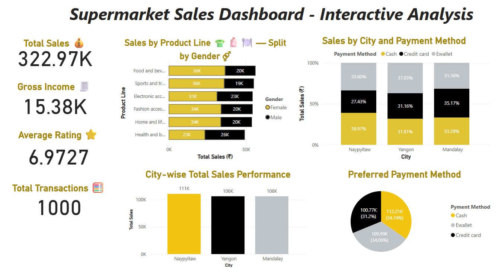
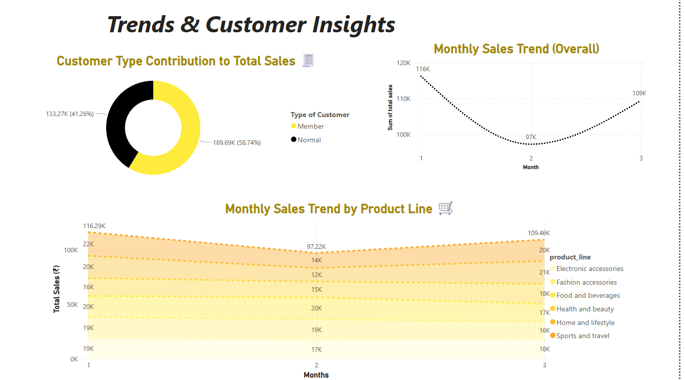

# 🛒 Supermarket Sales Analysis – Jupyter + Power BI Project

This is a full-cycle data analytics project where I performed data cleaning and exploratory data analysis (EDA) using **Jupyter Notebook**, and then built a fully interactive dashboard in **Power BI** to uncover insights about supermarket sales performance.

---

## 🧰 Tools Used

- 🐍 **Python (Jupyter Notebook)** – Data Cleaning, Feature Engineering & EDA
- 📊 **Power BI** – Dashboarding, Data Visualization, and Insight Generation
- 🐼 pandas, matplotlib, seaborn – For data wrangling & visual EDA
- 📈 DAX – For calculated KPIs in Power BI

---

## 📁 Project Workflow

### 1️⃣ **Data Cleaning & EDA (Jupyter Notebook)**

Performed in-depth data preprocessing, including:
- Renaming columns for consistency
- Converting data types (`Date`, `Time`)
- Creating new columns like `Month`, `Day`, `Weekday`, and `Datetime`
- Visual EDA using seaborn & matplotlib

📌 EDA Highlights:
- Sales & gross income by city, gender, and product line
- Payment method preferences
- Monthly and weekday-wise transaction patterns

➡️ *Notebook file included in the repo as* `Sales Analysis.ipynb`

---

### 2️⃣ **Interactive Dashboards (Power BI)**

#### 🔹 **Dashboard 1: Sales KPIs & Category Insights**

**KPI Cards:**
- ✅ Total Sales
- 💰 Gross Income
- 🌟 Average Rating
- 🧾 Total Transactions

**Visuals:**
- Product Line Sales split by Gender
- Sales by City & Payment Method
- City-wise Total Sales Performance
- Preferred Payment Methods by City

#### 🔹 **Dashboard 2: Trends & Customer Behavior**

**Visuals:**
- Customer Type Contribution to Sales
- Monthly Sales Trend
- Monthly Sales Trend by Product Line (Stacked Area Chart)

📎 *Power BI file included as* `Supermarket_Sales_Dashboard.pbix`

---

## 📂 Files Included

| File | Description |
|------|-------------|
| `Supermarket_Sales_Dashboard.pbix` | Full Power BI dashboard |
| `Cleaned_Supermarket_Data.csv`     | Cleaned dataset used in dashboard |
| `Supermarket_EDA_Cleaning.ipynb`   | Jupyter Notebook for data cleaning and EDA |
| `dashboard_screenshots/`           | Preview images of the dashboard |

---

## 📸 Preview

**Dashboard 1:** Sales KPIs, Product Line Split, City-Wise Sales

**Dashboard 2:** Monthly Sales Trend, Product Line Growth, Customer Segments

## 🔍 Key Insights

- **City C** generated the highest revenue and gross income.
- **"Food and Beverages"** was the top-selling product line.
- **Cash** was the most preferred payment method.
- Peak sales were observed on **Saturdays**, especially during evening hours.
- **Members** contributed more to total revenue than normal customers.

---

## 🚀 How to Run

1. Clone this repo
2. Open `Supermarket_EDA_Cleaning.ipynb` to explore the data and EDA
3. Open `Supermarket_Sales_Dashboard.pbix` using Power BI Desktop

---

## 👤 About Me

**Eram Memon**  
🎓 Final-Year IT Engineering Student | Aspiring Data Analyst  
📬 erammemon392@gmail.com  
🔗 [LinkedIn Profile](https://www.linkedin.com/in/eram-kandhal-46580b310/)

---

## ⭐ Like This Project?

If this project helped or inspired you, feel free to ⭐ it and connect on LinkedIn!

#PowerBI #Python #Jupyter #DataAnalytics #Dashboard #DataCleaning #EDA #BusinessIntelligence
